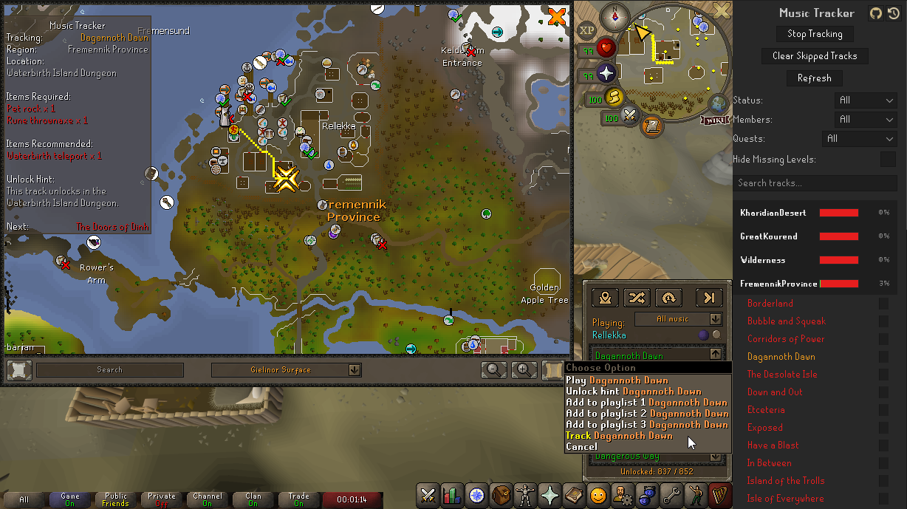
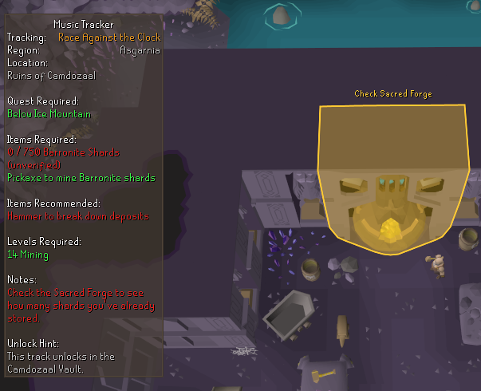
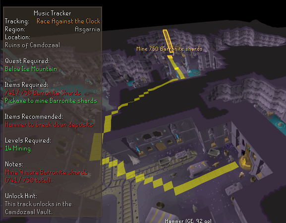
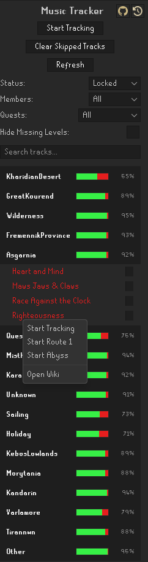
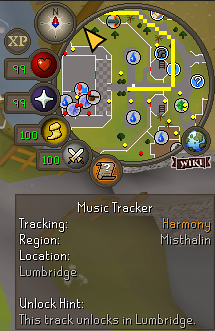
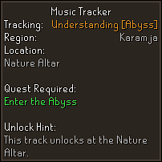
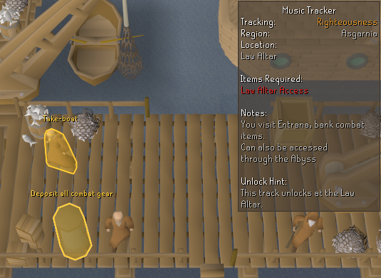
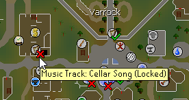

# Music Tracker


[](https://opensource.org/licenses/BSD-2-Clause)

A music unlock tracker for Old School RuneScape.

Track the progress of your music tracks with route navigation, requirement overlays, entity highlighting, and track auto-progression to help you earn your Music Cape.

> **Note:** This plugin integrates with the [Shortest Path](https://runelite.net/plugin-hub/show/shortest-path) plugin for navigation. It is highly recommended to have the Shortest Path plugin installed for the best experience.

> **Issues:** If you encounter any issues, please feel free to [report them here](https://github.com/The-DejaQ/music-tracker/issues/new).



## Features

- **Guided Pathing** — Navigate directly to music track unlocks with precise step-by-step routing, highlights, and Shortest Path support instead of just seeing a final destination.
- **Intelligent Progression** — The plugin automatically moves you through complex routes by recognizing when you complete interactions or reach key locations, while smartly handling teleports and plane changes.
- **Multiple Routes** — Choose between different paths for many tracks (including Abyss routes). Right-click any track to quickly switch routes on the fly.
- **Requirement Overlays** — See required and recommended items, levels, quests, and notes directly on screen.
- **Dynamic Requirements** — Automatically evaluates special requirements based on your current game state for certain tracks (e.g. whether you've sacrificed a Fire Cape for the Inferno, or completed specific diaries).
- **Entity Highlighting** — Highlights the correct NPC or object for the current step, with optional hint text.
- **Side Panel** — Clean collapsible region list with search, skip checkboxes, and color-coded track status.
- **Auto Progress** — Automatically moves to the next closest track after unlocking one.
- **World Map Integration** — Shows a Music Cape icon on the world map for your current target.
- **World Map Points** — Shows tracks you've unlocked or that are locked.
- **Shortest Path Support** — Integrates with the Shortest Path plugin for navigation.

## Screenshots

### Advanced unlocking (more routes to be added routinely)



### Side Panel



### Minimap Indicator



### In-Game Overlay



### Entity Highlighting



### World Map



## Installation

1. Open RuneLite
2. Go to the **Plugin Hub**
3. Search for **"Music Tracker"**
4. Click **Install**

Alternatively, you can build from source (see below).

## Usage

1. Open the side panel (Music Tracker icon in the sidebar).
2. Expand a region and click on a track to start tracking it.
3. The plugin will show you the current step, highlight the target entity, and display any requirements.
4. Use the **Start/Stop Tracking** button or right-click options for quick control.
5. Right-click a track in the panel to switch between available routes.

## Configuration

- **General**
    - Show progress bars in region headers
    - Remember skipped tracks between sessions
    - Use Shortest Path plugin for navigation

- **Progression**
    - Automatically progress to the next track after unlocking one
    - Prefer staying in the current region before moving to another

- **Messages**
    - Customize the color of plugin messages in the game chat

- **Overlay**
    - Toggle display of region, location, quest requirements, items, levels, notes, unlock hints, distance, and suggested next track

- **Entity Highlighting**
    - Customize the fill and outline color of on-screen highlights for the current step

- **World Map**
    - Show harp icons at music track unlock locations
    - Enable clicking world map icons to start tracking
    - Display a Music Cape world map point for the current target

- **Minimap**
    - Show a minimap arrow pointing to the current step's destination
    - Customize arrow color and animation style

### Building from Source

```bash
git clone https://github.com/The-DejaQ/music-tracker.git
cd music-tracker
./gradlew build